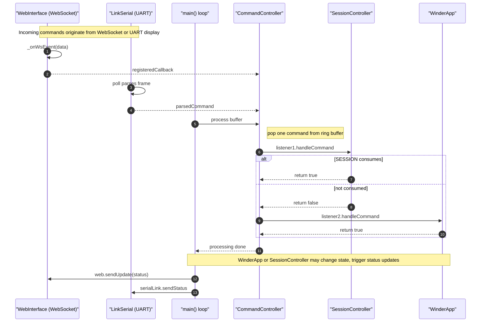

# CommandController sequence diagram

This Mermaid sequence diagram shows when and how `CommandController` receives and dispatches commands from WebSocket and UART, and how listeners consume them.

