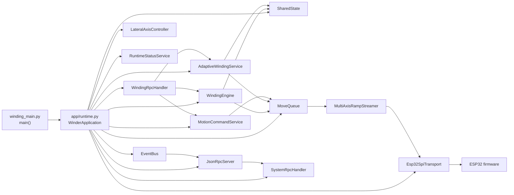
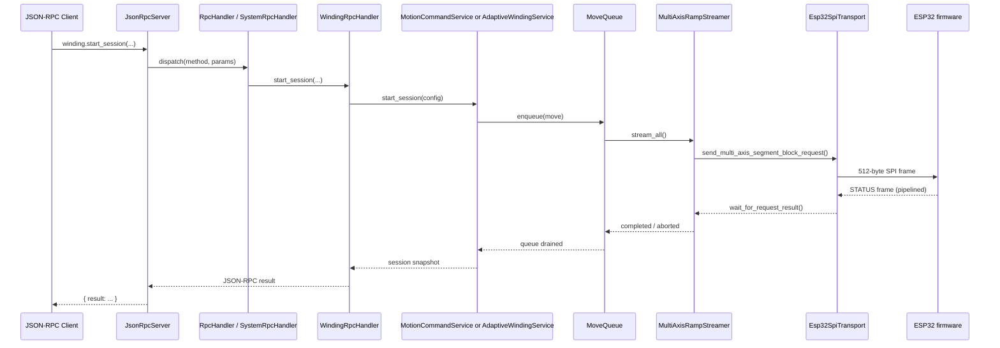
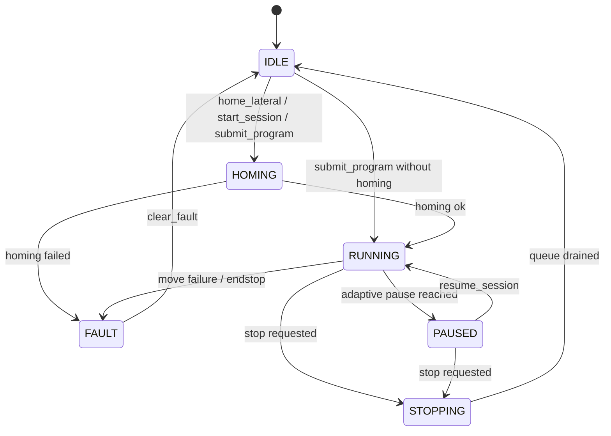

# Python Host Application Deep Dive For External AI Review

## Purpose

This document is a self-contained technical export of the Python host application under `src/rpi`.

It is written for an external AI reviewer that does not have direct access to the repository and therefore needs:

- a clear architecture map,
- the main runtime/control/data flows,
- the important invariants and failure modes,
- enough verbatim source code to reason about refactors and improvements.

Scope:

- Included: the active Python host runtime under `src/rpi`.
- Included: the host/firmware boundary where it materially affects host design.
- Excluded: detailed ESP32 internals except where the host contract depends on them.
- Excluded: most example clients under `src/rpi/examples` and diagnostic helpers under `src/rpi/diag`, because they are consumers, not the runtime core.

Important current context:

- The host runtime is now split by responsibility rather than startup order.
- There are two winding paths:
  - a classic program/layer path driven by `WindingEngine`,
  - an adaptive live session path driven by `AdaptiveWindingService`.
- `motion/` contains generic motion primitives and some compatibility re-exports.
- Real winding-domain implementations live primarily under `winding/`.

Recommended reading order for an external AI:

1. Read the three Mermaid diagrams.
2. Read the runtime path and threading model sections.
3. Read the source appendix in this order:
   - `winding_main.py`
   - `app/runtime.py`
   - `core/*.py`
   - `jsonrpc/*.py`
   - `motion/*.py`
   - `transport/*.py`
   - `winding/*.py`

Companion raw source dump:

- For a near-exhaustive concatenation of the active host Python code, see `doc/generated/rpi_python_host_full_dump.md`.
- That generated appendix includes almost all `src/rpi/**/*.py` files except `examples/`, `diag/`, and `__pycache__/`.

## Top-Level Source Tree

The active Python host code is structured as follows:

```text
src/rpi/
  winding_main.py            Process entry point
  app/
    runtime.py              Composition root / object graph
  core/
    config.py               Static machine configuration and derived limits
    engine.py               Classic winding-program orchestration thread
    events.py               Internal event bus used by RPC notifications
    lateral.py              Lateral-axis-specific homing and soft-limit rules
    shared_state.py         Shared runtime snapshot between worker threads and RPC
    status.py               Explicit process/config/engine snapshot builders
  jsonrpc/
    handlers.py             Method registry and system RPC surface
    protocol.py             JSON-RPC parsing and serialization
    rpc_server.py           Unix socket server and event notification loop
    winding_handler.py      Winding-specific RPC surface
  motion/
    __init__.py             Lazy re-exports for core motion primitives
    axis_state.py           Per-axis state and soft-limit tracking
    command_service.py      Manual motion / wound_run / transport command builder
    move.py                 BaseMove hierarchy and concrete move types
    move_queue.py           Serialized move executor and homing coordinator
    ramp_config.py          Ramp config and accel/decel time computation
    segment_generator.py    Time-domain to MultiAxisSegment sampling
    trapezoidal_profile.py  Trapezoidal speed/position model
    spindle_kinematics.py   Spindle turns-over-time model
    multi_axis_segment_generator.py  Generic synchronized segment generator
    winding_pattern.py      Thin wrapper to winding.winding_pattern
    scatter_engine.py       Thin wrapper to winding.scatter_engine
    synchronized_segment_generator.py Thin wrapper to winding.* sync generator
  transport/
    __init__.py             Transport exports and lazy streamer import
    messages.py             Host-side mirror of SPI protocol payloads and helpers
    spi_transport.py        Fixed-frame SPI transport and ACK polling
    streamer.py             Buffered multi-axis segment streaming to firmware
    mock_spi_transport.py   Test double for transport
  winding/
    __init__.py             Winding-domain exports
    program.py              Classic winding program dataclass
    winding_pattern.py      Turn-to-guide triangular wave mapping
    scatter_engine.py       Scatter offset model with edge damping
    synchronized_segment_generator.py  Electronic gearing generator
    wound_move.py           Classic synchronized winding move
    adaptive.py             Adaptive session config, planner, runtime, move
    service.py              Adaptive winding worker/service layer
```

## High-Level Architecture Diagram



Interpretation:

- `WinderApplication` is the composition root.
- `MoveQueue` is the serialized execution gateway for almost all motion.
- `WindingEngine` owns the classic queued program path.
- `AdaptiveWindingService` owns the live session path.
- `MotionCommandService` owns manual RPC-driven moves and transport commands.
- `JsonRpcServer` exposes both system-level and winding-level RPC surfaces.

## Main Request/Execution Sequence



Key non-obvious point:

- The host does not trust the immediate full-duplex response as the ACK for the current request.
- It uses `wait_for_request_result()` because SPI status is effectively pipelined by one transfer.

## Host State Model



Important nuance:

- `EngineState` is a host-side orchestration state, not a firmware state.
- The firmware has its own queue/ring/planner state, observed via `StatusPayload`.

## Runtime Path In Detail

### 1. Process start

- `src/rpi/winding_main.py` builds `WinderApplication`, starts it, and then blocks forever.
- Signal handlers call `app.stop()`.

### 2. Composition root

`WinderApplication` in `app/runtime.py` wires the full object graph:

- transport,
- shared state,
- event bus,
- move queue,
- lateral controller,
- status service,
- manual command service,
- adaptive winding service,
- classic winding engine,
- JSON-RPC handlers and server.

This is the central dependency-injection point for the host runtime.

### 3. Two winding paths

#### Classic program path

- Triggered by `winding.submit_program`.
- Uses `WindingProgram`.
- `WindingEngine` owns a daemon thread that waits on `_program_event`.
- For each program:
  - optionally home the lateral axis,
  - iterate layers,
  - create a `WoundMove` per layer,
  - enqueue it to `MoveQueue`,
  - wait for queue drain,
  - publish events and shared-state updates.

#### Adaptive session path

- Triggered by `winding.start_session`.
- Uses `AdaptiveWindingSessionConfig` and `AdaptiveWindingRuntime`.
- `AdaptiveWindingService` owns its own worker thread.
- It plans small winding chunks with `plan_next_chunk()` based on:
  - total turns remaining,
  - target/current spindle RPM,
  - current guide position,
  - active winding window,
  - requested pause/stop,
  - edge reversal constraints.
- Each chunk becomes an `AdaptiveWindingMove`, which still flows through `MoveQueue`.

### 4. Move queue as execution gate

`MoveQueue` is the main serialization barrier:

- one daemon thread,
- FIFO queue,
- exactly one active move at a time,
- special execution path for homing,
- generic execution path for ramp/jog moves,
- synchronized execution path for classic `WoundMove` and adaptive chunk moves.

This is one of the most important design choices in the host codebase because it linearizes the full motion stream before it reaches SPI.

### 5. Transport streaming path

At the bottom of the host stack:

- moves produce `MultiAxisSegment` objects,
- `MultiAxisRampStreamer` batches them into `MULTI_AXIS_SEGMENT_BLOCK` payloads,
- `Esp32SpiTransport` sends 512-byte fixed SPI frames,
- the host tracks in-flight motion sequences and retires them when firmware confirms execution.

## Threading Model

There are several distinct concurrent loops in the Python host:

- Main thread:
  - starts runtime,
  - installs signal handlers,
  - otherwise sleeps forever.
- `WindingEngine` thread:
  - waits for queued classic programs,
  - updates shared state and events.
- `MoveQueue` thread:
  - executes moves sequentially,
  - owns actual move-to-streamer execution.
- `AdaptiveWindingService` thread:
  - owns adaptive session planning and control logic.
- `JsonRpcServer` accept thread:
  - listens on Unix socket.
- `JsonRpcServer` notify thread:
  - forwards internal events as `winding.event` notifications.

Thread-safety primitives used across the host:

- `threading.RLock` in `SharedState` and `AdaptiveWindingRuntime`,
- `threading.Lock` in `MoveQueue` and `AxisState`,
- `threading.Event` for engine/program wakeup, queue wakeup, adaptive service wakeup, and RPC server shutdown.

## Important Invariants For External Review

1. Motion ordering is host-defined and serialized before SPI.

2. The lateral axis home state is volatile.

- If the enable bit drops according to firmware status, the host invalidates position/home.

3. Soft limits are host-side only.

- The host blocks illegal lateral motion before enqueue.

4. The move queue must propagate stop intent to the active streamer.

- Otherwise an interrupted chunk could be marked `COMPLETED` instead of `ABORTED`.

5. `motion/` contains generic motion primitives and lazy exports, but the winding semantics live under `winding/`.

6. Adaptive winding deliberately stops the spindle near window edges.

- The reversal is explicit in host planning rather than hidden inside a single long move.

## Runtime-Critical RPC Surface

### `winder.*`

- `winder.ping`
- `winder.status`
- `winder.shutdown`
- `winder.config`

### `winding.*`

Classic engine/program path:

- `winding.submit_program`
- `winding.stop`
- `winding.clear_fault`

Manual command path:

- `winding.jog`
- `winding.wound_run`
- `winding.run_axis`
- `winding.home_lateral`
- `winding.move_lateral_mm`
- `winding.flush_until`
- `winding.arm_endstop`
- `winding.disarm_endstop`

Adaptive live session path:

- `winding.start_session`
- `winding.update_session`
- `winding.pause_session`
- `winding.resume_session`
- `winding.session_status`

Observation path:

- `winding.status`
- `winding.axis_state`

## Notes On Compatibility Wrappers

The following modules are effectively compatibility veneers and should not be mistaken for the primary implementation location:

- `motion.winding_pattern`
- `motion.scatter_engine`
- `motion.synchronized_segment_generator`

The active implementation lives in:

- `winding.winding_pattern`
- `winding.scatter_engine`
- `winding.synchronized_segment_generator`

## Source Appendix

The rest of this document embeds the most important runtime source directly. For very large files, only the sections that define runtime structure or tricky behavior are included.

---

## Appendix A - Entry Point And Composition Root

### `src/rpi/winding_main.py`

```python
from __future__ import annotations

import logging
import signal
import sys
import time

from app import WinderApplication

logging.basicConfig(
    level=logging.INFO,
    format="%(asctime)s %(name)s %(levelname)s %(message)s",
)
logger = logging.getLogger("main")


def main() -> None:
    app = WinderApplication()
    app.start()
    logger.info("Winding controller started")

    def _shutdown(sig, frame) -> None:
        logger.info("Shutdown requested (signal %s)", sig)
        app.stop()
        sys.exit(0)

    signal.signal(signal.SIGINT, _shutdown)
    signal.signal(signal.SIGTERM, _shutdown)

    while True:
        time.sleep(1.0)


if __name__ == "__main__":
    main()
```

### `src/rpi/app/runtime.py`

```python
from __future__ import annotations

import logging
import re

from core import WindingEngine
from core.config import AppConfiguration
from core.events import EventBus
from core.shared_state import SharedState
from core.lateral import LateralAxisController
from core.status import RuntimeStatusService
from jsonrpc import JsonRpcServer, SystemRpcHandler
from jsonrpc.winding_handler import WindingRpcHandler
from motion.axis_state import AxisLimits, AxisState
from motion.command_service import MotionCommandService
from motion.move_queue import MoveQueue
from transport.spi_transport import Esp32SpiTransport
from winding.service import AdaptiveWindingService


logger = logging.getLogger(__name__)


def _parse_spi_device(device_path: str) -> tuple[int, int]:
    match = re.fullmatch(r"/dev/spidev(\d+)\.(\d+)", device_path)
    if match is None:
        raise ValueError("spi_device must be in the form /dev/spidev<bus>.<device>")
    return int(match.group(1)), int(match.group(2))


def _build_axis_states(config: AppConfiguration) -> dict[int, AxisState]:
    return {
        config.spindle_axis_id: AxisState(
            axis_id=config.spindle_axis_id,
            steps_per_rev=(
                config.spindle_steps_per_revolution * config.spindle_microstepping
            ),
        ),
        config.lateral_axis_id: AxisState(
            axis_id=config.lateral_axis_id,
            steps_per_rev=(
                config.lateral_steps_per_revolution * config.lateral_microstepping
            ),
            steps_per_mm=config.lateral_steps_per_mm,
            limits=AxisLimits(
                min_steps=config.lateral_soft_limit_min_steps,
                max_steps=config.lateral_soft_limit_max_steps,
            ),
        ),
    }


def _create_transport(config: AppConfiguration) -> Esp32SpiTransport:
    bus, device = _parse_spi_device(config.spi_device)
    logger.info(
        "Opening SPI transport on %s @ %d Hz",
        config.spi_device,
        config.spi_speed_hz,
    )
    return Esp32SpiTransport(
        bus=bus,
        device=device,
        speed_hz=config.spi_speed_hz,
        mode=0,
    )


class WinderApplication:
    """Compose the host runtime and own its process lifecycle."""

    def __init__(self, config: AppConfiguration | None = None) -> None:
        self.config = config or AppConfiguration()
        self.transport = _create_transport(self.config)
        self.shared_state = SharedState(axis_states=_build_axis_states(self.config))
        self.event_bus = EventBus()

        self.move_queue = MoveQueue(
            transport=self.transport,
            axis_states=self.shared_state.axis_states,
            poll_interval_s=0.005,
            print_every=8,
        )
        self.lateral_controller = LateralAxisController(
            transport=self.transport,
            shared_state=self.shared_state,
            move_queue=self.move_queue,
            event_bus=self.event_bus,
            config=self.config,
        )
        self.status_service = RuntimeStatusService(
            shared_state=self.shared_state,
            move_queue_status_provider=self.move_queue.status,
            lateral_controller=self.lateral_controller,
            config=self.config,
        )
        self.commands = MotionCommandService(
            transport=self.transport,
            shared_state=self.shared_state,
            move_queue=self.move_queue,
            lateral_controller=self.lateral_controller,
            config=self.config,
        )
        self.adaptive_winding = AdaptiveWindingService(
            shared_state=self.shared_state,
            move_queue=self.move_queue,
            lateral_controller=self.lateral_controller,
            event_bus=self.event_bus,
            config=self.config,
        )

        self.engine = WindingEngine(
            transport=self.transport,
            shared_state=self.shared_state,
            move_queue=self.move_queue,
            lateral_controller=self.lateral_controller,
            event_bus=self.event_bus,
            config=self.config,
        )
        self.rpc_handler = SystemRpcHandler(status_service=self.status_service)
        WindingRpcHandler(
            engine=self.engine,
            commands=self.commands,
            adaptive_winding=self.adaptive_winding,
            status_service=self.status_service,
        ).register_all(self.rpc_handler)
        self.rpc_server = JsonRpcServer(
            handler=self.rpc_handler,
            event_bus=self.event_bus,
            socket_path=self.config.rpc_socket_path,
        )
        self._started = False
        self._stopped = False

    def start(self) -> None:
        if self._started:
            return
        self.engine.start()
        self.rpc_server.start()
        self._started = True

    def stop(self) -> None:
        if self._stopped:
            return
        self._stopped = True
        if self._started:
            self.rpc_server.stop()
            self.adaptive_winding.stop()
            self.engine.stop()
            self._started = False
        self.transport.close()
```

## Appendix B - Core State, Configuration, And Orchestration

### `src/rpi/core/config.py`

```python
from dataclasses import dataclass
from typing import Optional

@dataclass
class AppConfiguration:
    """Configuration parameters for the PickupWinder host application."""

    rpc_socket_path: str = "/tmp/winding.sock"
    spi_device: str = "/dev/spidev0.0"
    spi_speed_hz: int = 4_000_000

    spindle_axis_id: int = 0
    spindle_steps_per_revolution: int = 200
    spindle_microstepping: int = 32
    spindle_invert_direction: bool = False
    spindle_max_speed_rpm: int = 1750
    spindle_max_acceleration_rpm: Optional[float] = 500
    spindle_max_deceleration_rpm: Optional[float] = None

    lateral_axis_id: int = 1
    lateral_steps_per_revolution: int = 200
    lateral_microstepping: int = 32
    lateral_invert_direction: bool = False
    lateral_max_rpm: int = 1000
    lateral_max_acceleration_mm_per_s2: Optional[float] = None
    lateral_max_deceleration_mm_per_s2: Optional[float] = None

    lateral_traverse_pitch_mm: float = 1.0
    lateral_steps_per_mm_override: Optional[float] = None
    lateral_soft_limit_min_mm: Optional[float] = 0.0
    lateral_soft_limit_max_mm: Optional[float] = None

    @property
    def lateral_steps_per_mm(self) -> float:
        if self.lateral_steps_per_mm_override is not None:
            return float(self.lateral_steps_per_mm_override)
        return (self.lateral_steps_per_revolution * self.lateral_microstepping) / float(self.lateral_traverse_pitch_mm)

    @property
    def lateral_soft_limit_min_steps(self) -> Optional[int]:
        if self.lateral_soft_limit_min_mm is None:
            return None
        return int(round(float(self.lateral_soft_limit_min_mm) * self.lateral_steps_per_mm))

    @property
    def lateral_soft_limit_max_steps(self) -> Optional[int]:
        if self.lateral_soft_limit_max_mm is None:
            return None
        return int(round(float(self.lateral_soft_limit_max_mm) * self.lateral_steps_per_mm))

    @property
    def spindle_max_acceleration_steps_per_s2(self) -> float:
        steps_per_rev = self.spindle_steps_per_revolution * self.spindle_microstepping
        if self.spindle_max_acceleration_rpm is not None:
            return (self.spindle_max_acceleration_rpm / 60.0) * steps_per_rev
        return 100_000.0

    @property
    def spindle_max_deceleration_steps_per_s2(self) -> float:
        steps_per_rev = self.spindle_steps_per_revolution * self.spindle_microstepping
        if self.spindle_max_deceleration_rpm is not None:
            return (self.spindle_max_deceleration_rpm / 60.0) * steps_per_rev
        return self.spindle_max_acceleration_steps_per_s2

    @property
    def lateral_max_acceleration_steps_per_s2(self) -> float:
        if self.lateral_max_acceleration_mm_per_s2 is not None:
            return float(self.lateral_max_acceleration_mm_per_s2) * self.lateral_steps_per_mm
        return 100_000.0

    @property
    def lateral_max_deceleration_steps_per_s2(self) -> float:
        if self.lateral_max_deceleration_mm_per_s2 is not None:
            return float(self.lateral_max_deceleration_mm_per_s2) * self.lateral_steps_per_mm
        return self.lateral_max_acceleration_steps_per_s2
```

### `src/rpi/core/events.py`

```python
from __future__ import annotations
import queue
from dataclasses import dataclass, field
from enum import Enum, auto
from typing import Any


class EventKind(Enum):
    PROGRAM_STARTED    = auto()
    PROGRAM_COMPLETED  = auto()
    PROGRAM_ABORTED    = auto()
    PROGRAM_FAILED     = auto()
    LAYER_STARTED      = auto()
    LAYER_COMPLETED    = auto()
    HOMING_STARTED     = auto()
    HOMING_COMPLETED   = auto()
    HOMING_FAILED      = auto()
    ENDSTOP_TRIGGERED  = auto()
    AXIS_STATE_CHANGED = auto()
    STATUS_UPDATE      = auto()


@dataclass(slots=True)
class Event:
    kind: EventKind
    data: dict[str, Any] = field(default_factory=dict)


class EventBus:
    MAX_EVENTS = 256

    def __init__(self) -> None:
        self._q: queue.Queue[Event] = queue.Queue(maxsize=self.MAX_EVENTS)

    def publish(self, kind: EventKind, **data: Any) -> None:
        try:
            self._q.put_nowait(Event(kind=kind, data=data))
        except queue.Full:
            pass

    def consume(self, timeout_s: float = 0.1) -> Event | None:
        try:
            return self._q.get(timeout=timeout_s)
        except queue.Empty:
            return None
```

### `src/rpi/core/shared_state.py`

```python
from __future__ import annotations

import threading
import time
from dataclasses import dataclass
from enum import Enum, auto
from typing import Any

from motion.axis_state import AxisState
from winding.program import WindingProgram


class EngineState(Enum):
    IDLE      = auto()
    HOMING    = auto()
    RUNNING   = auto()
    PAUSED    = auto()
    STOPPING  = auto()
    FAULT     = auto()


@dataclass(slots=True)
class LayerProgress:
    layer_index: int
    total_layers: int
    direction: str
    started_at: float
    completed_at: float | None = None


class SharedState:
    def __init__(self, axis_states: dict[int, AxisState]) -> None:
        self._lock = threading.RLock()
        self._engine_state = EngineState.IDLE
        self._current_program: WindingProgram | None = None
        self._current_layer: LayerProgress | None = None
        self._completed_layers: int = 0
        self._winding_session: dict[str, Any] | None = None
        self._fault_message: str | None = None
        self._started_at: float | None = None
        self._completed_at: float | None = None
        self.axis_states = axis_states

    def set_engine_state(self, state: EngineState) -> None:
        with self._lock:
            self._engine_state = state

    @property
    def engine_state(self) -> EngineState:
        with self._lock:
            return self._engine_state

    def set_program(self, program: WindingProgram | None) -> None:
        with self._lock:
            self._current_program = program
            self._completed_layers = 0
            self._fault_message = None
            self._started_at = time.monotonic() if program else None
            self._completed_at = None

    def start_layer(self, index: int, total: int, direction: str) -> None:
        with self._lock:
            self._current_layer = LayerProgress(
                layer_index=index,
                total_layers=total,
                direction=direction,
                started_at=time.monotonic(),
            )

    def complete_layer(self) -> None:
        with self._lock:
            if self._current_layer is not None:
                self._current_layer.completed_at = time.monotonic()
                self._completed_layers += 1

    def set_winding_session(self, snapshot: dict[str, Any] | None) -> None:
        with self._lock:
            self._winding_session = snapshot

    def set_fault(self, message: str) -> None:
        with self._lock:
            self._engine_state = EngineState.FAULT
            self._fault_message = message
            self._completed_at = time.monotonic()

    def clear_fault(self) -> None:
        with self._lock:
            if self._engine_state == EngineState.FAULT:
                self._engine_state = EngineState.IDLE
                self._fault_message = None

    def snapshot(self) -> dict[str, Any]:
        with self._lock:
            layer_snap = None
            if self._current_layer is not None:
                layer_snap = {
                    "index": self._current_layer.layer_index,
                    "total": self._current_layer.total_layers,
                    "direction": self._current_layer.direction,
                    "started_at": self._current_layer.started_at,
                    "completed_at": self._current_layer.completed_at,
                }
            return {
                "engine_state": self._engine_state.name,
                "program": self._current_program.snapshot() if self._current_program else None,
                "current_layer": layer_snap,
                "completed_layers": self._completed_layers,
                "winding_session": self._winding_session,
                "fault_message": self._fault_message,
                "started_at": self._started_at,
                "completed_at": self._completed_at,
                "axis_states": {
                    ax_id: state.snapshot()
                    for ax_id, state in self.axis_states.items()
                },
            }
```

### `src/rpi/core/status.py`

```python
from __future__ import annotations

import dataclasses
import time
from typing import Any, Callable

from core.config import AppConfiguration
from core.lateral import LateralAxisController
from core.shared_state import SharedState
from transport.messages import StatusPayload


def serialize_firmware_status(status: StatusPayload) -> dict[str, Any]:
    return {
        "uptime_ms": status.uptime_ms,
        "queue_free_slots": list(status.queue_free_slots),
        "ring_free_slots": list(status.ring_free_slots),
        "underrun_count": list(status.underrun_count),
        "last_rx_sequence": status.last_rx_sequence,
        "last_rx_type": status.last_rx_type,
        "last_result": status.last_result,
        "protocol_version": status.protocol_version,
        "enabled_mask": status.enabled_mask,
        "running_mask": status.running_mask,
        "lateral_endstop_state": status.lateral_endstop_state,
        "endstop_armed_mask": status.endstop_armed_mask,
        "endstop_hit_mask": status.endstop_hit_mask,
        "last_executed_sequence": status.last_executed_sequence,
        "multi_axis_queue_free": status.multi_axis_queue_free,
        "planner_queue_free": status.planner_queue_free,
        "last_planned_sequence": status.last_planned_sequence,
        "segments_dropped": status.segments_dropped,
    }


def serialize_configuration(config: AppConfiguration) -> dict[str, Any]:
    snapshot = dataclasses.asdict(config)
    snapshot["lateral_steps_per_mm"] = config.lateral_steps_per_mm
    snapshot["lateral_soft_limit_min_steps"] = config.lateral_soft_limit_min_steps
    snapshot["lateral_soft_limit_max_steps"] = config.lateral_soft_limit_max_steps
    snapshot["spindle_max_acceleration_steps_per_s2"] = config.spindle_max_acceleration_steps_per_s2
    snapshot["spindle_max_deceleration_steps_per_s2"] = config.spindle_max_deceleration_steps_per_s2
    snapshot["lateral_max_acceleration_steps_per_s2"] = config.lateral_max_acceleration_steps_per_s2
    snapshot["lateral_max_deceleration_steps_per_s2"] = config.lateral_max_deceleration_steps_per_s2
    return snapshot


class RuntimeStatusService:
    def __init__(
        self,
        *,
        shared_state: SharedState,
        move_queue_status_provider: Callable[[], dict[str, Any]],
        lateral_controller: LateralAxisController,
        config: AppConfiguration,
        started_at_monotonic: float | None = None,
    ) -> None:
        self._shared_state = shared_state
        self._move_queue_status_provider = move_queue_status_provider
        self._lateral = lateral_controller
        self._config = config
        self._started_at_monotonic = time.monotonic() if started_at_monotonic is None else started_at_monotonic

    def application_status(self) -> dict[str, Any]:
        return {
            "uptime_s": round(time.monotonic() - self._started_at_monotonic, 2),
            "configured": True,
            "engine_state": self._shared_state.engine_state.name,
            "rpc_socket_path": self._config.rpc_socket_path,
            "spi_device": self._config.spi_device,
        }

    def configuration_status(self) -> dict[str, Any]:
        return serialize_configuration(self._config)

    def engine_status(self) -> dict[str, Any]:
        self._lateral.refresh_home_state()
        return {
            "shared_state": self._shared_state.snapshot(),
            "move_queue": self._move_queue_status_provider(),
        }
```

### `src/rpi/core/lateral.py`

```python
from __future__ import annotations

import logging

from core.config import AppConfiguration
from core.events import EventBus, EventKind
from core.shared_state import SharedState
from motion import RampConfig
from motion.axis_state import AxisState
from motion.move import HomingMove
from motion.move_queue import MoveQueue
from transport.spi_transport import Esp32SpiTransport


logger = logging.getLogger(__name__)


class LateralAxisController:
    """Own lateral-axis-only rules so the engine stays orchestration-focused."""

    def __init__(
        self,
        *,
        transport: Esp32SpiTransport,
        shared_state: SharedState,
        move_queue: MoveQueue,
        event_bus: EventBus,
        config: AppConfiguration,
    ) -> None:
        self._transport = transport
        self._state = shared_state
        self._move_queue = move_queue
        self._events = event_bus
        self._config = config

    def home(
        self,
        *,
        axis_id: int,
        approach_rpm: float,
        search_rpm: float,
        backoff_steps: int,
    ) -> tuple[bool, str | None]:
        self._events.publish(EventKind.HOMING_STARTED, axis_id=axis_id)
        steps_per_rev = self._config.lateral_steps_per_revolution * self._config.lateral_microstepping
        move = HomingMove(
            name="home_lateral",
            axis_id=axis_id,
            steps_per_rev=steps_per_rev,
            approach_rpm=approach_rpm,
            search_rpm=search_rpm,
            backoff_steps=backoff_steps,
            max_approach_steps=int(steps_per_rev * 20),
            reverse_direction=self._config.lateral_invert_direction,
        )
        self._move_queue.enqueue(move)
        self._move_queue.wait_until_idle()

        if move.state.name == "COMPLETED":
            self._events.publish(EventKind.HOMING_COMPLETED, axis_id=axis_id)
            return True, None

        message = f"Homing failed: {move.error}"
        self._state.set_fault(message)
        self._events.publish(EventKind.HOMING_FAILED, axis_id=axis_id, error=message)
        return False, move.error

    def refresh_home_state(self) -> None:
        axis_state = self._state.axis_states.get(self._config.lateral_axis_id)
        if axis_state is None or not axis_state.homed:
            return
        try:
            status = self._transport.get_status()
        except Exception:
            return
        enabled_mask = int(getattr(status, "enabled_mask", 0))
        if (enabled_mask & (1 << self._config.lateral_axis_id)) != 0:
            return
        logger.warning("Lateral axis enable lost; invalidating homing state and position")
        axis_state.invalidate_position()

    def require_homed(self, axis_id: int | None = None) -> AxisState:
        lateral_axis_id = self._config.lateral_axis_id if axis_id is None else axis_id
        self.refresh_home_state()
        axis_state = self._state.axis_states[lateral_axis_id]
        if not axis_state.homed or axis_state.position_steps is None:
            raise RuntimeError("Lateral axis must be homed before motion")
        return axis_state

    def ensure_delta_allowed(self, delta_steps: int) -> None:
        axis_state = self.require_homed()
        if axis_state.check_move(delta_steps):
            return
        target_steps = (axis_state.position_steps or 0) + delta_steps
        target_mm = self.steps_to_mm(target_steps)
        raise ValueError(f"Lateral target {target_mm:.3f} mm is outside configured soft limits")

    def mm_to_steps(self, position_mm: float) -> int:
        return int(round(float(position_mm) * self._config.lateral_steps_per_mm))

    def steps_to_mm(self, position_steps: int) -> float:
        return float(position_steps) / float(self._config.lateral_steps_per_mm)

    @staticmethod
    def ramp_delta_steps(ramp: RampConfig) -> int:
        total_steps = int(round(ramp.steps_at(ramp.total_duration)))
        return -total_steps if ramp.reverse_direction else total_steps
```

### `src/rpi/core/engine.py`

```python
from __future__ import annotations

import logging
import threading
import time
from typing import Any

from core.config import AppConfiguration
from core.events import EventBus, EventKind
from core.lateral import LateralAxisController
from core.shared_state import EngineState, SharedState
from motion import SpindleKinematics
from motion.command_service import adjust_duration_for_ramp_deficit
from motion.move_queue import MoveQueue
from transport.spi_transport import Esp32SpiTransport
from winding import ScatterEngine, SyncAxisConfig, WindingPattern, WoundMove
from winding.program import WindingProgram


logger = logging.getLogger(__name__)

_DEFAULT_HOME_APPROACH_RPM = 100.0
_DEFAULT_HOME_SEARCH_RPM = 20.0
_DEFAULT_HOME_BACKOFF_STEPS = 3200


class WindingEngine:
    def __init__(self,*,transport: Esp32SpiTransport,shared_state: SharedState,move_queue: MoveQueue,
                 lateral_controller: LateralAxisController,event_bus: EventBus,config: AppConfiguration | None = None,) -> None:
        self._transport = transport
        self._state = shared_state
        self._move_queue = move_queue
        self._lateral = lateral_controller
        self._events = event_bus
        self._config = config or AppConfiguration()

        self._shutdown_event = threading.Event()
        self._stop_request_event = threading.Event()
        self._program_event = threading.Event()
        self._pending_program: WindingProgram | None = None
        self._program_lock = threading.Lock()
        self._thread: threading.Thread | None = None

    def start(self) -> None:
        if self._thread is not None and self._thread.is_alive():
            return

        self._shutdown_event.clear()
        self._stop_request_event.clear()
        self._move_queue.start()
        self._thread = threading.Thread(target=self._run, daemon=True, name="winding_engine")
        self._thread.start()

    def stop(self, timeout_s: float = 5.0) -> None:
        self._shutdown_event.set()
        self._stop_request_event.set()
        self._program_event.set()
        self._move_queue.stop(timeout_s=timeout_s)
        if self._thread is not None:
            self._thread.join(timeout=timeout_s)

    def submit_program(self, program: WindingProgram) -> None:
        with self._program_lock:
            if self._state.engine_state not in (EngineState.IDLE, EngineState.FAULT):
                raise RuntimeError(f"Cannot submit program: engine is {self._state.engine_state.name}")
            program.validate()
            self._pending_program = program
            self._stop_request_event.clear()
            self._program_event.set()

    def request_stop(self) -> None:
        self._stop_request_event.set()
        self._move_queue.clear()
        if self._state.engine_state in (EngineState.HOMING, EngineState.RUNNING):
            self._state.set_engine_state(EngineState.STOPPING)

    def clear_fault(self) -> None:
        self._state.clear_fault()

    def _run(self) -> None:
        while not self._shutdown_event.is_set():
            self._program_event.wait(timeout=1.0)
            self._program_event.clear()

            with self._program_lock:
                program = self._pending_program
                self._pending_program = None

            if program is None:
                continue
            if self._shutdown_event.is_set():
                break

            self._execute_program(program)

    def _execute_program(self, program: WindingProgram) -> None:
        self._stop_request_event.clear()
        self._state.set_program(program)
        self._state.set_engine_state(EngineState.HOMING if program.home_before_start else EngineState.RUNNING)
        self._events.publish(EventKind.PROGRAM_STARTED, program=program.snapshot())

        if program.home_before_start:
            success, _reason = self._lateral.home(
                axis_id=program.lateral_axis_id,
                approach_rpm=program.home_approach_rpm,
                search_rpm=program.home_search_rpm,
                backoff_steps=program.home_backoff_steps,
            )
            if not success:
                return
            self._state.set_engine_state(EngineState.RUNNING)
        else:
            self._lateral.require_homed(program.lateral_axis_id)

        for layer_index in range(program.num_layers):
            if self._stop_requested():
                self._state.set_engine_state(EngineState.IDLE)
                self._events.publish(EventKind.PROGRAM_ABORTED, layer=layer_index)
                return

            direction = "forward" if layer_index % 2 == 0 else "reverse"
            self._state.start_layer(layer_index, program.num_layers, direction)
            self._events.publish(EventKind.LAYER_STARTED, layer=layer_index, direction=direction)

            ok = self._run_layer(program, layer_index, direction)
            if not ok:
                return

            self._state.complete_layer()
            self._events.publish(EventKind.LAYER_COMPLETED, layer=layer_index)

        self._state.set_engine_state(EngineState.IDLE)
        self._state.set_program(None)
        self._events.publish(EventKind.PROGRAM_COMPLETED, program=program.snapshot())

    def _run_layer(self, program: WindingProgram, layer_index: int, direction: str) -> bool:
        reverse_lateral = direction == "reverse"
        total_turns = 2.0 * program.bobbin_width_mm * program.turns_per_mm
        target_rps = program.spindle_rpm / 60.0
        duration_s = adjust_duration_for_ramp_deficit(
            total_turns=total_turns,
            target_rps=target_rps,
            accel_s=program.accel_s,
            decel_s=program.decel_s,
        )
        cruise_s = max(duration_s - program.accel_s - program.decel_s, 0.0)

        move = WoundMove(
            name=f"layer_{layer_index}",
            kinematics=SpindleKinematics(
                target_rpm=program.spindle_rpm,
                start_rpm=0.0,
                accel_s=program.accel_s,
                cruise_s=cruise_s,
                decel_s=program.decel_s,
            ),
            pattern=WindingPattern(
                bobbin_width_mm=program.bobbin_width_mm,
                turns_per_mm=program.turns_per_mm,
            ),
            scatter=ScatterEngine(
                amplitude_mm=program.scatter_amplitude_mm,
                freq1=program.scatter_freq1,
                freq2=program.scatter_freq2,
                damping_margin_mm=program.scatter_damping_margin_mm,
            ),
            spindle_cfg=SyncAxisConfig(
                axis_index=program.spindle_axis_id,
                steps_per_unit=(self._config.spindle_steps_per_revolution * self._config.spindle_microstepping),
            ),
            traverse_cfg=SyncAxisConfig(
                axis_index=program.lateral_axis_id,
                steps_per_unit=program.lateral_steps_per_mm,
                reverse_direction=reverse_lateral,
            ),
        )
        self._move_queue.enqueue(move)
        self._wait_for_move_queue()

        if move.aborted_by_endstop:
            msg = f"Endstop triggered during layer {layer_index}"
            self._state.set_fault(msg)
            self._events.publish(EventKind.ENDSTOP_TRIGGERED, layer=layer_index, axis=program.lateral_axis_id)
            return False

        if move.state.name == "FAILED":
            self._state.set_fault(move.error or "unknown error")
            return False

        if self._stop_requested():
            self._state.set_engine_state(EngineState.IDLE)
            self._events.publish(EventKind.PROGRAM_ABORTED, layer=layer_index)
            return False

        return True

    def _stop_requested(self) -> bool:
        return self._shutdown_event.is_set() or self._stop_request_event.is_set()

    def _wait_for_move_queue(self, poll_s: float = 0.05, timeout_s: float = 60.0) -> None:
        deadline = time.monotonic() + timeout_s
        while not self._stop_requested() and (self._move_queue.pending_count > 0 or self._move_queue.current_move is not None):
            if time.monotonic() >= deadline:
                msg = f"_wait_for_move_queue timed out after {timeout_s:.1f} s - firmware may have stopped responding"
                self._state.set_fault(msg)
                break
            time.sleep(poll_s)
```

## Appendix C - JSON-RPC Surface

The JSON-RPC layer is intentionally thin. It does three things only:

- register typed method callbacks,
- parse/validate/serialize JSON-RPC envelopes,
- bridge internal `EventBus` events to JSON-RPC notifications.

### `src/rpi/jsonrpc/handlers.py`

```python
from __future__ import annotations

import time
from typing import Any, Callable

from core.status import RuntimeStatusService, serialize_configuration
from .protocol import JsonRpcMethodNotFoundError

MethodCallback = Callable[..., Any]


class RpcHandler:
    def __init__(self) -> None:
        self._methods: dict[str, MethodCallback] = {}

    def register_method(self, method: str, callback: MethodCallback) -> None:
        self._methods[method] = callback

    def dispatch(self, method: str, params: Any | None) -> Any:
        callback = self._methods.get(method)
        if callback is None:
            raise JsonRpcMethodNotFoundError(method)
        if params is None:
            return callback()
        if isinstance(params, list):
            return callback(*params)
        if isinstance(params, dict):
            try:
                return callback(**params)
            except TypeError:
                return callback(params)
        return callback(params)


class SystemRpcHandler(RpcHandler):
    def __init__(
        self,
        *,
        status_service: RuntimeStatusService | None = None,
        app: Any | None = None,
    ) -> None:
        super().__init__()
        self._status_service = status_service
        self._app = app
        self._started_at = time.monotonic()
        self.register_method("winder.ping", self._rpc_ping)
        self.register_method("winder.status", self._rpc_status)
        self.register_method("winder.shutdown", self._rpc_shutdown)
        self.register_method("winder.config", self._rpc_config)

    def ping(self) -> dict[str, str]:
        return {"message": "pong"}

    def status(self) -> dict[str, Any]:
        if self._status_service is not None:
            return self._status_service.application_status()
        return {
            "uptime_s": round(time.monotonic() - self._started_at, 2),
            "configured": bool(self._app is not None),
        }

    def shutdown(self) -> dict[str, str]:
        return {"message": "shutdown-not-implemented"}

    def config(self) -> dict[str, Any]:
        if self._status_service is not None:
            return self._status_service.configuration_status()
        if self._app is None:
            return {}
        config = getattr(self._app, "config", None) or getattr(self._app, "_config", None)
        if config is None:
            return {}
        return serialize_configuration(config)
```

### `src/rpi/jsonrpc/protocol.py`

```python
from __future__ import annotations

import json
from dataclasses import dataclass
from typing import Any

JSONRPC_VERSION = "2.0"


class JsonRpcError(Exception):
    def __init__(self, code: int, message: str, data: Any | None = None) -> None:
        super().__init__(message)
        self.code = code
        self.message = message
        self.data = data


class JsonRpcParseError(JsonRpcError):
    def __init__(self, data: Any | None = None) -> None:
        super().__init__(-32700, "Parse error", data)


class JsonRpcInvalidRequestError(JsonRpcError):
    def __init__(self, data: Any | None = None) -> None:
        super().__init__(-32600, "Invalid Request", data)


class JsonRpcMethodNotFoundError(JsonRpcError):
    def __init__(self, method: str) -> None:
        super().__init__(-32601, f"Method not found: {method}", {"method": method})


@dataclass
class JsonRpcRequest:
    method: str
    params: Any | None
    id: Any | None


def parse_json_rpc(payload: str) -> JsonRpcRequest:
    message = json.loads(payload)
    if not isinstance(message, dict):
        raise JsonRpcInvalidRequestError(message)
    if message.get("jsonrpc") != JSONRPC_VERSION:
        raise JsonRpcInvalidRequestError(message)
    if "method" not in message or not isinstance(message["method"], str):
        raise JsonRpcInvalidRequestError(message)
    return JsonRpcRequest(
        method=message["method"],
        params=message.get("params"),
        id=message.get("id"),
    )


def make_response(result: Any, request_id: Any | None) -> str:
    return json.dumps({"jsonrpc": JSONRPC_VERSION, "result": result, "id": request_id})


def make_error_response(error: JsonRpcError, request_id: Any | None) -> str:
    payload = {
        "jsonrpc": JSONRPC_VERSION,
        "error": {
            "code": error.code,
            "message": error.message,
        },
        "id": request_id,
    }
    if error.data is not None:
        payload["error"]["data"] = error.data
    return json.dumps(payload)
```

### `src/rpi/jsonrpc/rpc_server.py`

```python
from __future__ import annotations

import json
import logging
import os
import socket
import threading

from core.events import EventBus
from .handlers import RpcHandler
from .protocol import JsonRpcError, make_error_response, make_response, parse_json_rpc

logger = logging.getLogger(__name__)


class JsonRpcServer:
    """JSON-RPC 2.0 server over a Unix domain socket."""

    BUFFER_SIZE = 65536

    def __init__(self, handler: RpcHandler, event_bus: EventBus, socket_path: str = "/tmp/winding.sock") -> None:
        self._handler = handler
        self._events = event_bus
        self._socket_path = socket_path
        self._accept_thread: threading.Thread | None = None
        self._notify_thread: threading.Thread | None = None
        self._stop_event = threading.Event()
        self._client_lock = threading.Lock()
        self._current_client: socket.socket | None = None
        self._server_socket: socket.socket | None = None

    def start(self) -> None:
        if os.path.exists(self._socket_path):
            os.unlink(self._socket_path)
        self._stop_event.clear()
        self._server_socket = socket.socket(socket.AF_UNIX, socket.SOCK_STREAM)
        self._server_socket.bind(self._socket_path)
        self._server_socket.listen(1)
        self._server_socket.settimeout(1.0)
        self._accept_thread = threading.Thread(target=self._accept_loop, daemon=True, name="rpc_accept")
        self._notify_thread = threading.Thread(target=self._notify_loop, daemon=True, name="rpc_notify")
        self._accept_thread.start()
        self._notify_thread.start()

    def _notify_loop(self) -> None:
        while not self._stop_event.is_set():
            event = self._events.consume(timeout_s=0.1)
            if event is None:
                continue
            notification = {
                "jsonrpc": "2.0",
                "method": "winding.event",
                "params": {
                    "kind": event.kind.name,
                    "data": event.data,
                },
            }
            with self._client_lock:
                client = self._current_client
            if client is None:
                continue
            try:
                client.sendall((json.dumps(notification) + "\n").encode("utf-8"))
            except OSError:
                pass

    def _dispatch(self, raw: str) -> str | None:
        try:
            request = parse_json_rpc(raw)
        except JsonRpcError as exc:
            return make_error_response(exc, None)

        try:
            result = self._handler.dispatch(request.method, request.params)
        except JsonRpcError as exc:
            return make_error_response(exc, request.id)
        except TypeError as exc:
            return make_error_response(JsonRpcError(-32602, f"Invalid params: {exc}"), request.id)
        except Exception as exc:
            logger.exception("RPC method %s raised", request.method)
            return make_error_response(JsonRpcError(-32000, str(exc)), request.id)

        if request.id is None:
            return None
        return make_response(result, request.id)
```

### `src/rpi/jsonrpc/winding_handler.py`

This file is the external host contract. It is the best place for an external AI to enumerate user-facing capabilities.

```python
from __future__ import annotations

from typing import Any

from core import WindingEngine
from core.status import RuntimeStatusService
from jsonrpc.handlers import RpcHandler
from jsonrpc.protocol import JsonRpcError
from motion.command_service import MotionCommandService
from winding import AdaptiveWindingSessionConfig
from winding.program import WindingProgram
from winding.service import AdaptiveWindingService


class WindingRpcHandler:
    def __init__(
        self,
        *,
        engine: WindingEngine,
        commands: MotionCommandService,
        adaptive_winding: AdaptiveWindingService,
        status_service: RuntimeStatusService,
    ) -> None:
        self._engine = engine
        self._commands = commands
        self._adaptive_winding = adaptive_winding
        self._status_service = status_service

    def register_all(self, handler: RpcHandler) -> None:
        handler.register_method("winding.submit_program", self.submit_program)
        handler.register_method("winding.start_session", self.start_session)
        handler.register_method("winding.update_session", self.update_session)
        handler.register_method("winding.pause_session", self.pause_session)
        handler.register_method("winding.resume_session", self.resume_session)
        handler.register_method("winding.session_status", self.session_status)
        handler.register_method("winding.stop", self.stop)
        handler.register_method("winding.jog", self.jog)
        handler.register_method("winding.wound_run", self.wound_run)
        handler.register_method("winding.run_axis", self.run_axis)
        handler.register_method("winding.home_lateral", self.home_lateral)
        handler.register_method("winding.move_lateral_mm", self.move_lateral_mm)
        handler.register_method("winding.clear_fault", self.clear_fault)
        handler.register_method("winding.flush_until", self.flush_until)
        handler.register_method("winding.status", self.status)
        handler.register_method("winding.axis_state", self.axis_state)
        handler.register_method("winding.arm_endstop", self.arm_endstop)
        handler.register_method("winding.disarm_endstop", self.disarm_endstop)

    def submit_program(self, program: dict) -> dict[str, Any]:
        p = WindingProgram(**program)
        self._engine.submit_program(p)
        return {"status": "queued", "program": p.snapshot()}

    def start_session(self, session: dict[str, Any]) -> dict[str, Any]:
        config = AdaptiveWindingSessionConfig(**session)
        snapshot = self._adaptive_winding.start_session(config)
        return {"status": "started", "session": snapshot}

    def update_session(self, **params: Any) -> dict[str, Any]:
        snapshot = self._adaptive_winding.update_session(**params)
        return {"status": "updated", "session": snapshot}

    def pause_session(self, pause_at_turn: float | None = None) -> dict[str, Any]:
        snapshot = self._adaptive_winding.pause_session(pause_at_turn=pause_at_turn)
        return {"status": "pausing", "session": snapshot}

    def resume_session(self, _params: Any | None = None) -> dict[str, Any]:
        snapshot = self._adaptive_winding.resume_session()
        return {"status": "running", "session": snapshot}

    def session_status(self, _params: Any | None = None) -> dict[str, Any]:
        return self._adaptive_winding.session_status()

    def stop(self, _params: Any | None = None) -> dict[str, str]:
        adaptive_status = self._adaptive_winding.session_status()
        if adaptive_status.get("active") and adaptive_status.get("session") is not None:
            self._adaptive_winding.request_stop()
            return {"status": "stopping"}
        self._engine.request_stop()
        return {"status": "stopping"}
```

## Appendix D - Motion Primitives And Move Serialization

### `src/rpi/motion/axis_state.py`

```python
from __future__ import annotations

from dataclasses import dataclass
from threading import Lock
from typing import Optional

from transport.messages import LATERAL_ENDSTOP_PRESENT_CLOSED


@dataclass
class AxisLimits:
    min_steps: Optional[int] = None
    max_steps: Optional[int] = None


class AxisState:
    def __init__(
        self,
        axis_id: int,
        steps_per_rev: int = 200 * 32,
        steps_per_mm: float | None = None,
        limits: AxisLimits | None = None,
    ) -> None:
        self.axis_id = axis_id
        self.steps_per_rev = steps_per_rev
        self.steps_per_mm = steps_per_mm
        self.limits = limits or AxisLimits()
        self._lock = Lock()
        self._position_steps: int | None = None
        self._homed: bool = False
        self._endstop_state: int = 255

    @property
    def position_steps(self) -> int | None:
        with self._lock:
            return self._position_steps

    def advance_position(self, delta_steps: int) -> None:
        with self._lock:
            if self._position_steps is not None:
                self._position_steps += delta_steps

    def invalidate_position(self) -> None:
        with self._lock:
            self._position_steps = None
            self._homed = False

    def mark_homed(self, position_steps: int = 0) -> None:
        with self._lock:
            self._position_steps = position_steps
            self._homed = True

    def check_move(self, delta_steps: int) -> bool:
        with self._lock:
            if self._position_steps is None:
                return True
            target = self._position_steps + delta_steps
            if self.limits.min_steps is not None and target < self.limits.min_steps:
                return False
            if self.limits.max_steps is not None and target > self.limits.max_steps:
                return False
            return True

    def update_endstop_state(self, state: int) -> None:
        with self._lock:
            self._endstop_state = state

    def snapshot(self) -> dict:
        with self._lock:
            return {
                "axis_id": self.axis_id,
                "position_steps": self._position_steps,
                "homed": self._homed,
                "endstop_state": self._endstop_state,
                "endstop_triggered": self._endstop_state == LATERAL_ENDSTOP_PRESENT_CLOSED,
                "soft_limit_min_steps": self.limits.min_steps,
                "soft_limit_max_steps": self.limits.max_steps,
            }
```

### `src/rpi/motion/ramp_config.py`

```python
from dataclasses import dataclass

from .trapezoidal_profile import TrapezoidalMotionProfile


def compute_ramp_times(
    target_rpm: float,
    duration_s: float,
    max_accel_steps_per_s2: float,
    max_decel_steps_per_s2: float,
    steps_per_rev: int,
    start_rpm: float = 0.0,
    min_ramp_s: float = 0.05,
    max_ramp_fraction: float = 0.25,
) -> tuple[float, float, float]:
    start_hz = start_rpm / 60.0 * float(steps_per_rev)
    target_hz = target_rpm / 60.0 * float(steps_per_rev)
    delta_hz = max(target_hz - start_hz, 0.0)
    physics_accel_s = delta_hz / max_accel_steps_per_s2 if max_accel_steps_per_s2 > 0.0 else min_ramp_s
    physics_decel_s = delta_hz / max_decel_steps_per_s2 if max_decel_steps_per_s2 > 0.0 else min_ramp_s
    cap = duration_s * max_ramp_fraction
    accel_s = max(min_ramp_s, min(physics_accel_s, cap))
    decel_s = max(min_ramp_s, min(physics_decel_s, cap))
    cruise_s = max(duration_s - accel_s - decel_s, 0.0)
    return accel_s, cruise_s, decel_s


@dataclass(slots=True)
class RampConfig:
    axis_id: int = 0
    steps_per_rev: int = 200 * 32
    start_rpm: float = 0.0
    target_rpm: float = 1000.0
    accel_s: float = 10.0
    cruise_s: float = 3.0
    decel_s: float = 10.0
    resolution_hz: int = 80_000_000
    reverse_direction: bool = False

    @property
    def profile(self) -> TrapezoidalMotionProfile:
        return TrapezoidalMotionProfile(
            start_rpm=self.start_rpm,
            target_rpm=self.target_rpm,
            accel_s=self.accel_s,
            cruise_s=self.cruise_s,
            decel_s=self.decel_s,
        )

    def steps_at(self, t: float) -> float:
        return self.profile.steps_at(t, self.steps_per_rev)
```

### `src/rpi/motion/trapezoidal_profile.py`

```python
from __future__ import annotations


class TrapezoidalMotionProfile:
    def __init__(self, start_rpm: float = 0.0, target_rpm: float = 1000.0, accel_s: float = 0.0, cruise_s: float = 0.0, decel_s: float = 0.0) -> None:
        self.start_rpm = start_rpm
        self.target_rpm = target_rpm
        self.accel_s = accel_s
        self.cruise_s = cruise_s
        self.decel_s = decel_s

    @property
    def total_duration(self) -> float:
        return self.accel_s + self.cruise_s + self.decel_s

    def rps_at(self, t: float) -> float:
        t = min(max(t, 0.0), self.total_duration)
        start_rps = self.start_rpm / 60.0
        target_rps = self.target_rpm / 60.0
        if t < self.accel_s:
            if self.accel_s <= 0.0:
                return target_rps
            rate = (target_rps - start_rps) / self.accel_s
            return start_rps + rate * t
        t -= self.accel_s
        if t < self.cruise_s:
            return target_rps
        t -= self.cruise_s
        if self.decel_s <= 0.0:
            return target_rps
        rate = (target_rps - start_rps) / self.decel_s
        return max(target_rps - rate * t, 0.0)

    def turns_at(self, t: float) -> float:
        t = min(max(t, 0.0), self.total_duration)
        start_rps = self.start_rpm / 60.0
        target_rps = self.target_rpm / 60.0
        if t < self.accel_s:
            if self.accel_s <= 0.0:
                return target_rps * t
            rate = (target_rps - start_rps) / self.accel_s
            return start_rps * t + 0.5 * rate * t * t
        turns = 0.0
        if self.accel_s > 0.0:
            rate = (target_rps - start_rps) / self.accel_s
            turns += start_rps * self.accel_s + 0.5 * rate * self.accel_s * self.accel_s
        t -= self.accel_s
        if t < self.cruise_s:
            return turns + target_rps * t
        turns += target_rps * self.cruise_s
        t -= self.cruise_s
        if self.decel_s <= 0.0:
            return max(turns + target_rps * t, 0.0)
        rate = (target_rps - start_rps) / self.decel_s
        return max(turns + target_rps * t - 0.5 * rate * t * t, 0.0)
```

### `src/rpi/motion/spindle_kinematics.py`

```python
from __future__ import annotations

from dataclasses import dataclass
from .trapezoidal_profile import TrapezoidalMotionProfile


@dataclass(slots=True)
class SpindleKinematics(TrapezoidalMotionProfile):
    target_rpm: float
    start_rpm: float = 0.0
    accel_s: float = 2.0
    cruise_s: float = 10.0
    decel_s: float = 2.0

    def __post_init__(self) -> None:
        super().__init__(
            start_rpm=self.start_rpm,
            target_rpm=self.target_rpm,
            accel_s=self.accel_s,
            cruise_s=self.cruise_s,
            decel_s=self.decel_s,
        )
```

### `src/rpi/motion/segment_generator.py`

```python
from __future__ import annotations

from abc import ABC, abstractmethod
from dataclasses import dataclass
from typing import Callable, Iterator, Tuple

from transport.messages import MultiAxisSegment


@dataclass(slots=True)
class AxisStepProfile:
    axis_index: int
    step_at: Callable[[float], float]
    reverse_direction: bool = False
    total_duration: float = 0.0


class BaseSegmentGenerator(ABC):
    MIN_STEPS_PER_SEGMENT = 32
    MIN_DURATION_S = 0.002
    MAX_DURATION_S = 0.050

    def __init__(self, *, segment_duration_s: float = 0.004, start_sequence: int = 0) -> None:
        self._base_segment_duration_s = max(self.MIN_DURATION_S, min(self.MAX_DURATION_S, segment_duration_s))
        self.segment_duration_s = self._base_segment_duration_s
        self._sequence = start_sequence & 0xFFFF
        self._time_cursor = 0.0
        self.overall_duration = 0.0

    def _adaptive_duration(self, estimated_step_rate: float) -> float:
        if estimated_step_rate <= 0.0:
            return self._base_segment_duration_s
        min_duration = self.MIN_STEPS_PER_SEGMENT / estimated_step_rate
        return max(self.MIN_DURATION_S, min(self.MAX_DURATION_S, max(min_duration, self._base_segment_duration_s)))


class StepProfileSegmentGenerator(BaseSegmentGenerator):
    def _compute_segment(self, time_start: float, time_end: float) -> Tuple[list[int], list[int]]:
        steps = [0] * len(self.axis_profiles)
        directions = [0] * len(self.axis_profiles)
        for index, profile in enumerate(self.axis_profiles):
            target_steps = profile.step_at(time_end)
            delta_steps = target_steps - self._current_steps[index]
            count = int(round(self._axis_errors[index] + delta_steps))
            self._axis_errors[index] += delta_steps - float(count)
            self._current_steps[index] = target_steps
            is_negative = count < 0
            if is_negative:
                count = abs(count)
            directions[index] = 1 if is_negative ^ profile.reverse_direction else 0
            steps[index] = count
        return steps, directions
```

### `src/rpi/motion/multi_axis_segment_generator.py`

```python
from __future__ import annotations

from dataclasses import dataclass

from .ramp_config import RampConfig
from .segment_generator import AxisStepProfile, StepProfileSegmentGenerator


@dataclass(slots=True)
class AxisMotionConfig:
    axis_id: int
    ramp: RampConfig


class MultiAxisSegmentGenerator(StepProfileSegmentGenerator):
    def __init__(self, axis_configs: list[AxisMotionConfig], *, segment_duration_s: float = 0.004, start_sequence: int = 0):
        self.axis_configs = axis_configs
        axis_profiles = [
            AxisStepProfile(
                axis_index=config.axis_id,
                step_at=lambda t, ramp=config.ramp: ramp.steps_at(t),
                reverse_direction=config.ramp.reverse_direction,
                total_duration=config.ramp.total_duration,
            )
            for config in axis_configs
        ]
        super().__init__(axis_profiles, segment_duration_s=segment_duration_s, start_sequence=start_sequence)
```

### `src/rpi/motion/move.py` (selected excerpts)

```python
from __future__ import annotations

import time
from abc import ABC, abstractmethod
from dataclasses import dataclass
from enum import Enum, auto
from typing import Any, Iterator

from motion import AxisMotionConfig, MultiAxisSegmentGenerator, RampConfig
from transport.messages import MultiAxisSegment


class MoveState(Enum):
    PENDING = auto()
    RUNNING = auto()
    COMPLETED = auto()
    ABORTED = auto()
    FAILED = auto()


class BaseMove(ABC):
    def __init__(self, name: str) -> None:
        self.name = name
        self._state = MoveState.PENDING
        self._started_at: float | None = None
        self._completed_at: float | None = None
        self._error: str | None = None
        self._aborted_by_endstop: bool = False

    def mark_running(self) -> None:
        self._state = MoveState.RUNNING
        self._started_at = time.monotonic()

    def mark_completed(self) -> None:
        self._state = MoveState.COMPLETED
        self._completed_at = time.monotonic()

    def mark_aborted(self, reason: str, by_endstop: bool = False) -> None:
        self._state = MoveState.ABORTED
        self._completed_at = time.monotonic()
        self._error = reason
        self._aborted_by_endstop = by_endstop

    def mark_failed(self, error: str) -> None:
        self._state = MoveState.FAILED
        self._completed_at = time.monotonic()
        self._error = error


@dataclass(slots=True)
class RampMoveConfig:
    axis_configs: list[AxisMotionConfig]
    segment_duration_s: float = 0.004


class RampMove(Move):
    def __init__(self, name: str, config: RampMoveConfig) -> None:
        super().__init__(name)
        self._config = config

    def segments(self) -> Iterator[MultiAxisSegment]:
        gen = MultiAxisSegmentGenerator(self._config.axis_configs, segment_duration_s=self._config.segment_duration_s)
        yield from gen


class HomingMove(CompositeMove):
    def phases(self) -> list[tuple[str, RampMove, bool]]:
        return [
            ("approach", self._make_approach_move(), True),
            ("backoff", self._make_backoff_move(), False),
            ("search", self._make_search_move(), True),
        ]


class JogMove(Move):
    def __init__(self, name: str, axis_id: int, steps_per_rev: int, steps: int, rpm: float, reverse_direction: bool = False, segment_duration_s: float = 0.004) -> None:
        super().__init__(name)
        self.axis_id = axis_id
        self._steps = steps
        self._reverse = reverse_direction
        total_s = (steps / float(steps_per_rev)) / (rpm / 60.0)
        self._config = RampMoveConfig(
            axis_configs=[
                AxisMotionConfig(
                    axis_id=axis_id,
                    ramp=RampConfig(
                        axis_id=axis_id,
                        steps_per_rev=steps_per_rev,
                        target_rpm=rpm,
                        accel_s=min(0.15, total_s * 0.2),
                        cruise_s=max(total_s - 0.3, 0.0),
                        decel_s=min(0.15, total_s * 0.2),
                        reverse_direction=reverse_direction,
                    ),
                )
            ],
            segment_duration_s=segment_duration_s,
        )
```

### `src/rpi/motion/move_queue.py` (selected excerpts)

This is one of the most critical host files. It defines how every move is serialized, how homing phases are interleaved with endstop arming, and how position knowledge is invalidated after abnormal stops.

```python
class MoveQueue:
    def __init__(self, transport, axis_states, *, poll_interval_s: float = 0.001, print_every: int = 1) -> None:
        self._transport = transport
        self._axis_states = axis_states
        self._poll_interval_s = poll_interval_s
        self._print_every = print_every
        self._queue: deque[BaseMove] = deque()
        self._queue_lock = threading.Lock()
        self._queue_event = threading.Event()
        self._stop_requested = False
        self._thread: threading.Thread | None = None
        self._current_move: BaseMove | None = None
        self._current_streamer: MultiAxisRampStreamer | None = None

    def enqueue(self, move: BaseMove) -> None:
        with self._queue_lock:
            self._queue.append(move)
        self._queue_event.set()

    def _execute_move(self, move: BaseMove) -> None:
        if self._stop_requested:
            move.mark_aborted("stop requested before execution")
            return
        try:
            if isinstance(move, CompositeMove):
                self._execute_homing(move)
            elif isinstance(move, WoundMove) or getattr(move, "is_synchronized_move", False):
                self._execute_wound_move(move)
            elif isinstance(move, Move):
                self._execute_ramp_move(move)
            else:
                move.mark_failed(f"unsupported move type: {type(move).__name__}")
        except Exception as exc:
            move.mark_failed(str(exc))

    def _request_current_streamer_stop(self) -> None:
        streamer = self._current_streamer
        if streamer is not None:
            streamer.request_stop()

    def _execute_ramp_move(self, move: Move) -> None:
        move.mark_running()
        axis_configs = move.axis_configs
        streamer = self._make_streamer(axis_configs, keep_enabled_axes=self._axes_to_keep_enabled(move.axis_ids))
        self._current_streamer = streamer
        streamer.set_generator(self._wrap_segment_sequence(move.segments(), self._next_motion_sequence()))
        try:
            streamer.stream_all()
        finally:
            self._current_streamer = None

        if streamer.endstop_triggered:
            for ax_id in move.axis_ids:
                if ax_id in self._axis_states:
                    self._axis_states[ax_id].invalidate_position()
            move.mark_aborted("endstop triggered", by_endstop=True)
            return

        if self._stop_requested or streamer.has_stop_been_requested():
            move.mark_aborted("stop requested")
            return

        for ax_id in move.axis_ids:
            delta = move.expected_delta_steps(ax_id)
            if delta is not None and ax_id in self._axis_states:
                self._axis_states[ax_id].advance_position(delta)
        move.mark_completed()

    def _execute_wound_move(self, move: WoundMove) -> None:
        move.mark_running()
        streamer = self._make_wound_streamer(move, keep_enabled_axes=self._axes_to_keep_enabled(move.axis_ids))
        self._current_streamer = streamer
        streamer.set_generator(self._wrap_segment_sequence(move.segments(), self._next_motion_sequence()))
        try:
            streamer.stream_all()
        finally:
            self._current_streamer = None

        if streamer.endstop_triggered:
            for ax_id in move.axis_ids:
                if ax_id in self._axis_states:
                    self._axis_states[ax_id].invalidate_position()
            move.mark_aborted("endstop triggered", by_endstop=True)
            return

        if self._stop_requested or streamer.has_stop_been_requested():
            for ax_id in move.axis_ids:
                if ax_id in self._axis_states:
                    self._axis_states[ax_id].invalidate_position()
            move.mark_aborted("stop requested")
            return

        for ax_id in move.axis_ids:
            delta = move.expected_delta_steps(ax_id)
            if delta is None:
                self._axis_states[ax_id].invalidate_position()
                continue
            self._axis_states[ax_id].advance_position(delta)
        move.mark_completed()

    def _execute_homing(self, move: HomingMove) -> None:
        move.mark_running()
        for phase_name, sub_move, arm_endstop in move.phases():
            if self._stop_requested:
                self._set_endstop_armed(move.axis_id, arm=False)
                move.mark_aborted("stop requested during homing")
                return

            self._set_endstop_armed(move.axis_id, arm=arm_endstop)
            streamer = self._stream_homing_sub_move(move, phase_name=phase_name, sub_move=sub_move, arm_endstop=arm_endstop)

            if phase_name in ("approach", "search"):
                self._check_armed_phase_result(move, phase_name, streamer)

            if phase_name == "backoff":
                self._wait_for_endstop_open(move.axis_id, timeout_s=self._compute_backoff_timeout(sub_move))

        self._set_endstop_armed(move.axis_id, arm=False)
        axis_state = self._axis_states.get(move.axis_id)
        if axis_state is not None:
            axis_state.mark_homed(move.home_position_steps)
        move.mark_completed()
```

### `src/rpi/motion/command_service.py` (selected excerpts)

```python
def adjust_duration_for_ramp_deficit(*, total_turns: float, target_rps: float, accel_s: float, decel_s: float) -> float:
    if target_rps <= 0.0:
        return 0.05
    turns_deficit = 0.5 * target_rps * (max(accel_s, 0.0) + max(decel_s, 0.0))
    adjusted_turns = max(total_turns, 0.0) + turns_deficit
    return max(adjusted_turns / target_rps, 0.05)


class MotionCommandService:
    def jog(self, axis_id: int, steps: int, rpm: float, reverse: bool = False) -> None:
        if self._state.engine_state != EngineState.IDLE:
            raise RuntimeError("Jog only allowed when engine is IDLE")
        move = JogMove(name=f"jog_{axis_id}", axis_id=axis_id, steps_per_rev=steps_per_rev, steps=steps, rpm=rpm, reverse_direction=reverse)
        self._move_queue.enqueue(move)

    def move_lateral_to_mm(self, position_mm: float, rpm: float) -> dict[str, Any]:
        axis_state = self._lateral.require_homed()
        current_steps = axis_state.position_steps
        target_steps = self._lateral.mm_to_steps(position_mm)
        delta_steps = target_steps - current_steps
        self._lateral.ensure_delta_allowed(delta_steps)
        if delta_steps == 0:
            return {"status": "already_at_position", "position_mm": position_mm}
        self.jog(axis_id=self._config.lateral_axis_id, steps=abs(delta_steps), rpm=rpm, reverse=(delta_steps < 0))
        return {"status": "queued", "target_position_mm": position_mm, "target_position_steps": target_steps}

    def run_axis(self, duration_s: float, targets: list[dict[str, Any]]) -> None:
        axis_configs: list[AxisMotionConfig] = []
        for target in targets:
            axis_id = int(target["axis_id"])
            rpm = float(target["rpm"])
            reverse = bool(target.get("reverse", False))
            accel_s, cruise_s, decel_s = compute_ramp_times(...)
            ramp = RampConfig(axis_id=axis_id, steps_per_rev=steps_per_rev, target_rpm=target_rpm, accel_s=accel_s, cruise_s=cruise_s, decel_s=decel_s, reverse_direction=reverse)
            axis_configs.append(AxisMotionConfig(axis_id=axis_id, ramp=ramp))
        self._move_queue.enqueue(RampMove(name="run_axis", config=RampMoveConfig(axis_configs=axis_configs)))
```

## Appendix E - SPI Protocol Mirror And Streamer

### `src/rpi/transport/messages.py` (selected excerpts)

This module mirrors the firmware protocol layout and therefore carries strong binary-compatibility constraints.

```python
from dataclasses import dataclass
from enum import IntEnum
import struct

SPI_MSG_MAGIC = 0x5057
SPI_MSG_VERSION = 3
SPI_FRAME_SIZE = 512
SPI_MAX_AXES = 4
MULTI_AXIS_SEGMENT_BLOCK_SIZE = 60


class SpiMessageType(IntEnum):
    GET_STATUS = 0x06
    STEP_BLOCK = 0x10
    SEGMENT_BLOCK = 0x11
    FLUSH = 0x12
    MULTI_AXIS_SEGMENT_BLOCK = 0x13
    ENABLE_ENDSTOP = 0x14
    STATUS = 0x80


class SpiMessageResult(IntEnum):
    OK = 0x00
    QUEUE_FULL = 0x07
    INTERNAL_ERROR = 0x08
    ENDSTOP_BLOCKED = 0x09


@dataclass(slots=True)
class MultiAxisSegment:
    sequence: int
    duration_us: int
    steps: list[int]
    directions: list[int]


@dataclass(slots=True)
class MultiAxisSegmentBlockPayload:
    axis_ids: list[int]
    block_seq: int
    segments: list[MultiAxisSegment]


def crc16_ccitt(data: bytes) -> int:
    crc = 0xFFFF
    for byte in data:
        crc ^= byte << 8
        for _ in range(8):
            if crc & 0x8000:
                crc = ((crc << 1) ^ 0x1021) & 0xFFFF
            else:
                crc = (crc << 1) & 0xFFFF
    return crc


def sequence_signed_distance(a: int, b: int) -> int:
    return ((a - b + 0x8000) & 0xFFFF) - 0x8000


def sequence_is_greater(a: int, b: int) -> bool:
    return sequence_signed_distance(a, b) > 0


def sequence_is_less_equal(a: int, b: int) -> bool:
    return sequence_signed_distance(a, b) <= 0
```

### `src/rpi/transport/spi_transport.py` (selected excerpts)

```python
class Esp32SpiTransport:
    def __init__(self, bus: int | None = None, device: int | None = None, *, device_path: str | None = None, speed_hz: int = 1_000_000, mode: int = 0):
        import spidev
        self._spi = spidev.SpiDev()
        self._open_bus = bus
        self._open_device = device
        self._open_device_path = device_path
        self._speed_hz = speed_hz
        self._mode = mode
        self._open_spi()
        self._sequence = 0
        self._io_lock = threading.Lock()
        self._last_status: StatusPayload | None = None

    def _xfer(self, frame: bytes) -> bytes:
        tx = list(frame)
        if hasattr(self._spi, "xfer3"):
            return bytes(self._spi.xfer3(tx, self._speed_hz, 700, 8))
        return bytes(self._spi.xfer2(tx, self._speed_hz, 700, 8))

    def transfer_frame(self, frame: bytes) -> StatusPayload:
        for attempt in range(15):
            with self._io_lock:
                response = self._xfer(frame)
            try:
                status = parse_status_frame(response)
                self._last_status = status
                self._last_status_ts = time.monotonic()
                return status
            except ValueError as exc:
                if attempt < 14 and ("bad magic" in str(exc) or "bad response CRC" in str(exc)):
                    time.sleep(0.0005 if response[:32] == b"\x00" * 32 else 0.001)
                    continue
                raise

    def wait_for_request_result(self, sequence: int, *, poll_interval_s: float = 0.001, timeout_s: float = 1.5) -> StatusPayload:
        deadline = time.monotonic() + max(timeout_s, 0.05)
        while True:
            if time.monotonic() >= deadline:
                raise RuntimeError(f"wait_for_request_result timeout for seq={sequence}: no matching ack")
            status = self.get_status(timeout_s=min(0.25, max(0.02, deadline - time.monotonic())), allow_stale=False)
            if status.last_rx_sequence == (sequence & 0xFFFF):
                return status
            time.sleep(poll_interval_s)

    def poll_status(self, *, timeout_s: float = 1.0, allow_stale: bool = True) -> StatusPayload:
        ...
        if allow_stale and self._last_status is not None:
            age_s = time.monotonic() - self._last_status_ts
            if age_s <= 2.0:
                return self._last_status
        raise RuntimeError(...)

    def send_multi_axis_segment_block_request(self, payload: MultiAxisSegmentBlockPayload) -> tuple[int, StatusPayload]:
        return self.transfer_request(make_multi_axis_segment_block(payload, self._next_sequence()))

    def flush_until(self, sequence: int) -> StatusPayload:
        transport_sequence, _ = self.transfer_request(make_flush(FlushPayload(flush_sequence=sequence), self._next_sequence()))
        return self.wait_for_request_result(transport_sequence)
```

### `src/rpi/transport/streamer.py` (selected excerpts)

This file contains the host-side real-time buffering policy. It is the main place to look for performance, latency, or backpressure issues.

```python
class MultiAxisRampStreamer:
    TARGET_BUFFER_TIME_S = 0.10
    MIN_BUFFER_TIME_S = 0.06
    MAX_BUFFER_TIME_S = 0.25
    SEGMENT_QUEUE_DEPTH = 128
    STEP_RING_CAPACITY = 4096

    @staticmethod
    def required_lookahead(steps_per_segment: int) -> int:
        if steps_per_segment < 10:
            return 48
        elif steps_per_segment < 50:
            return 32
        else:
            return 32

    def _check_planner_pressure(self, status) -> bool:
        pqf = self._planner_queue_free(status)
        self._buffered_segments = self.SEGMENT_QUEUE_DEPTH - pqf
        if self._prefilling:
            return False
        needed = self.required_lookahead(self._current_steps_per_segment)
        return self._buffered_segments >= needed

    def _check_stall(self, status) -> bool:
        if self._last_confirmed_sequence < 0:
            self._last_sequence_advance_time = time.time()
            return False
        if not self._inflight:
            self._last_sequence_advance_time = time.time()
            return False
        if sequence_is_greater(received_sequence, self._last_sequence_advance_value):
            self._last_sequence_advance_value = received_sequence
            self._last_sequence_advance_time = time.time()
            return False
        if time.time() - self._last_sequence_advance_time > self._stall_timeout_s:
            self.request_stop()
            self.request_flush(self._last_sent_motion_seq)
            return True
        return False

    def _check_endstop(self, status) -> bool:
        for axis_id in self._endstop_armed_axes:
            if hit_mask & (1 << axis_id):
                self._mark_endstop_triggered()
                return True
        for axis_id in self._endstop_armed_axes:
            axis_stopped = (running_mask & (1 << axis_id)) == 0
            if lateral_state == LATERAL_ENDSTOP_PRESENT_CLOSED and axis_stopped:
                self._mark_endstop_triggered()
                return True
        return False

    def _collect_and_send_batch(self, status) -> tuple[int, Any] | None:
        if self._generator_finished and self._retry_batch is None:
            return None
        batch = [] if self._retry_batch is None else list(self._retry_batch)
        while (
            len(batch) < MULTI_AXIS_SEGMENT_BLOCK_SIZE
            and self._buffered_time_s < self._target_buffer_time_s
            and len(self._inflight) < self._max_inflight_segments()
            and not self._queue_full(status)
            and not self._check_planner_pressure(status)
        ):
            segment = next(self._generator)
            batch.append(segment)
        payload = MultiAxisSegmentBlockPayload(axis_ids=self._axis_ids, block_seq=batch[0].sequence, segments=batch)
        transport_seq, _ = self._transport.send_multi_axis_segment_block_request(payload)
        ack_status = self._transport.wait_for_request_result(transport_seq, poll_interval_s=self._poll_interval_s)
        if ack_status.last_result == int(SpiMessageResult.OK):
            for seg in batch:
                self._inflight.append((seg, transport_seq))
                self._buffered_time_s += seg.duration_us / 1_000_000.0
                self._last_sent_motion_seq = seg.sequence
            return len(batch), ack_status
        elif ack_status.last_result == int(SpiMessageResult.QUEUE_FULL):
            self._retry_batch = list(batch)
            return 0, ack_status
        raise RuntimeError(...)

    def stream_all(self) -> int:
        status = self._transport.get_status()
        axes_enabled = False
        total_segments = 0
        try:
            self._enable_axes()
            axes_enabled = True
            status = self._transport.get_status()
            self._check_endstop(status)
            if not self._stop_requested:
                total_segments, status = self._prefill(status)
            while True:
                if self._stop_requested:
                    if self._flush_sequence_requested is not None:
                        self.flush_until(self._flush_sequence_requested)
                    break
                self._remove_confirmed_segments(status)
                self._log_runtime_diagnostics(status)
                if self._check_stall(status) or self._check_endstop(status):
                    break
                cycle_segments_sent = 0
                while not self._generator_finished:
                    if self._stop_requested or self._endstop_triggered:
                        break
                    if cycle_segments_sent >= self._max_segments_per_cycle():
                        break
                    result = self._collect_and_send_batch(status)
                    if result is None:
                        break
                    n, status = result
                    if n == 0:
                        break
                    cycle_segments_sent += n
                    total_segments += n
                if self._generator_finished and not self._inflight and self._retry_batch is None:
                    break
                if cycle_segments_sent == 0:
                    status = self._transport.get_status()
                    self._remove_confirmed_segments(status)
                sleep_s = self._should_sleep()
                if sleep_s > 0.0:
                    time.sleep(sleep_s)
        finally:
            if axes_enabled:
                self._disable_axes()
        return total_segments
```

## Appendix F - Winding Domain

### `src/rpi/winding/program.py`

```python
from __future__ import annotations

from dataclasses import dataclass
from typing import Any


@dataclass(slots=True)
class WindingProgram:
    name: str
    num_layers: int
    spindle_rpm: float
    layer_pitch_mm: float
    wire_diameter_mm: float
    bobbin_width_mm: float = 15.0
    scatter_amplitude_mm: float = 0.0
    scatter_damping_margin_mm: float = 0.0
    scatter_freq1: float = 1.0
    scatter_freq2: float = 1.618
    accel_s: float = 0.5
    decel_s: float = 0.5
    spindle_axis_id: int = 0
    lateral_axis_id: int = 1
    lateral_steps_per_mm: float = 200.0 * 32.0 / 8.0
    home_before_start: bool = True
    home_approach_rpm: float = 100.0
    home_search_rpm: float = 20.0
    home_backoff_steps: int = 3200

    @property
    def turns_per_mm(self) -> float:
        return 1.0 / self.layer_pitch_mm

    def layer_duration_s(self) -> float:
        spindle_rps = self.spindle_rpm / 60.0
        total_turns = 2.0 * self.bobbin_width_mm * self.turns_per_mm
        return total_turns / spindle_rps
```

### `src/rpi/winding/winding_pattern.py`

```python
from __future__ import annotations

from dataclasses import dataclass


@dataclass(slots=True)
class WindingPattern:
    bobbin_width_mm: float
    turns_per_mm: float

    def guide_pos_mm(self, spindle_turns: float) -> float:
        total_dist = spindle_turns / self.turns_per_mm
        cycle_length = 2.0 * self.bobbin_width_mm
        mod_dist = total_dist % cycle_length
        if mod_dist <= self.bobbin_width_mm:
            return mod_dist
        return cycle_length - mod_dist
```

### `src/rpi/winding/scatter_engine.py`

```python
from __future__ import annotations

import math
from dataclasses import dataclass


@dataclass(slots=True)
class ScatterEngine:
    amplitude_mm: float = 0.0
    freq1: float = 1.0
    freq2: float = 1.618
    damping_margin_mm: float = 1.0

    def get_offset(self, spindle_turns: float, base_guide_pos_mm: float, bobbin_width_mm: float) -> float:
        if self.amplitude_mm <= 0.0:
            return 0.0
        raw_scatter = (math.sin(self.freq1 * spindle_turns) + math.sin(self.freq2 * spindle_turns)) / 2.0
        offset = raw_scatter * self.amplitude_mm
        min_dist = min(base_guide_pos_mm, bobbin_width_mm - base_guide_pos_mm)
        if min_dist < self.damping_margin_mm and self.damping_margin_mm > 0:
            offset *= max(0.0, min_dist / self.damping_margin_mm)
        return offset
```

### `src/rpi/winding/synchronized_segment_generator.py`

```python
from __future__ import annotations

from dataclasses import dataclass

from motion.segment_generator import AxisStepProfile, StepProfileSegmentGenerator
from motion.spindle_kinematics import SpindleKinematics
from winding.winding_pattern import WindingPattern
from winding.scatter_engine import ScatterEngine


@dataclass(slots=True)
class SyncAxisConfig:
    axis_index: int
    steps_per_unit: float
    reverse_direction: bool = False


class SynchronizedSegmentGenerator(StepProfileSegmentGenerator):
    def __init__(self, spindle_kinematics: SpindleKinematics, pattern: WindingPattern, scatter: ScatterEngine, spindle_config: SyncAxisConfig, traverse_config: SyncAxisConfig, segment_duration_s: float = 0.004, start_sequence: int = 0):
        def spindle_steps_at(t: float) -> float:
            return spindle_kinematics.turns_at(t) * spindle_config.steps_per_unit

        def traverse_steps_at(t: float) -> float:
            turns = spindle_kinematics.turns_at(t)
            base_traverse_mm = pattern.guide_pos_mm(turns)
            scatter_offset = scatter.get_offset(turns, base_traverse_mm, pattern.bobbin_width_mm)
            return (base_traverse_mm + scatter_offset) * traverse_config.steps_per_unit

        axis_profiles = [
            AxisStepProfile(axis_index=spindle_config.axis_index, step_at=spindle_steps_at, reverse_direction=spindle_config.reverse_direction, total_duration=spindle_kinematics.total_duration),
            AxisStepProfile(axis_index=traverse_config.axis_index, step_at=traverse_steps_at, reverse_direction=traverse_config.reverse_direction, total_duration=spindle_kinematics.total_duration),
        ]
        super().__init__(axis_profiles, segment_duration_s=segment_duration_s, start_sequence=start_sequence)
```

### `src/rpi/winding/wound_move.py`

```python
from __future__ import annotations

from typing import Iterator

from motion.move import Move
from motion import SpindleKinematics
from winding.winding_pattern import WindingPattern
from winding.scatter_engine import ScatterEngine
from winding.synchronized_segment_generator import SyncAxisConfig, SynchronizedSegmentGenerator
from transport.messages import MultiAxisSegment


class WoundMove(Move):
    def __init__(self, name: str, kinematics: SpindleKinematics, pattern: WindingPattern, scatter: ScatterEngine, spindle_cfg: SyncAxisConfig, traverse_cfg: SyncAxisConfig, segment_duration_s: float = 0.004) -> None:
        super().__init__(name)
        self.kinematics = kinematics
        self.pattern = pattern
        self.scatter = scatter
        self.spindle_cfg = spindle_cfg
        self.traverse_cfg = traverse_cfg
        self.segment_duration_s = segment_duration_s

    def segments(self) -> Iterator[MultiAxisSegment]:
        gen = SynchronizedSegmentGenerator(self.kinematics, self.pattern, self.scatter, self.spindle_cfg, self.traverse_cfg, segment_duration_s=self.segment_duration_s)
        yield from gen

    def expected_delta_steps(self, axis_id: int) -> int | None:
        return None
```

### `src/rpi/winding/adaptive.py` (selected excerpts)

This file is the core of the live-controllable winding path.

```python
from __future__ import annotations

import math
import threading
from dataclasses import dataclass
from typing import Any, Iterator

from motion.move import Move
from motion.segment_generator import AxisStepProfile, StepProfileSegmentGenerator
from motion.spindle_kinematics import SpindleKinematics
from transport.messages import MultiAxisSegment
from winding.scatter_engine import ScatterEngine
from winding.synchronized_segment_generator import SyncAxisConfig

_EPSILON = 1e-6


@dataclass(slots=True)
class WindingWindow:
    low_mm: float
    high_mm: float


@dataclass(slots=True)
class AdaptiveWindingSessionConfig:
    name: str
    total_turns: float
    target_rpm: float
    window_low_mm: float
    window_high_mm: float
    wire_diameter_mm: float | None = None
    wire_awg: int | None = None
    turns_per_mm_override: float | None = None
    pitch_factor: float = 1.0
    chunk_time_s: float = 0.25

    @property
    def turns_per_mm(self) -> float:
        if self.turns_per_mm_override is not None:
            return float(self.turns_per_mm_override)
        return 1.0 / (self.resolved_wire_diameter_mm * self.pitch_factor)


@dataclass(slots=True)
class AdaptivePlanningSnapshot:
    total_turns: float
    completed_turns: float
    current_rpm: float
    target_rpm: float
    turns_per_mm: float
    chunk_time_s: float
    current_guide_mm: float
    direction_sign: int
    window: WindingWindow
    pause_requested: bool
    pause_at_turn: float | None


def plan_next_chunk(snapshot: AdaptivePlanningSnapshot, *, spindle_accel_rps2: float, spindle_decel_rps2: float):
    remaining_turns = max(snapshot.total_turns - snapshot.completed_turns, 0.0)
    if remaining_turns <= _EPSILON:
        return None
    ...
    # The planner cuts the session into explicit accel / cruise / stop-at-edge / stop-at-pause chunks.


class AdaptiveWindingRuntime:
    def __init__(self, session: AdaptiveWindingSessionConfig, *, spindle_steps_per_rev: int, lateral_steps_per_mm: float) -> None:
        self._lock = threading.RLock()
        self._session = session
        self._window = session.window
        self._wire_diameter_mm = session.resolved_wire_diameter_mm
        self._target_rpm = session.target_rpm
        self._current_turns = 0.0
        self._current_rpm = 0.0
        self._current_guide_mm = self._window.low_mm
        self._direction_sign = 1
        self._pause_requested = False
        self._stop_requested = False
        self._pending_reposition_mm: float | None = None
        self._state = "queued"

    def planning_snapshot(self) -> AdaptivePlanningSnapshot:
        with self._lock:
            return AdaptivePlanningSnapshot(
                total_turns=self._session.total_turns,
                completed_turns=self._current_turns,
                current_rpm=self._current_rpm,
                target_rpm=self._target_rpm,
                turns_per_mm=self.turns_per_mm,
                chunk_time_s=self._session.chunk_time_s,
                current_guide_mm=self._current_guide_mm,
                direction_sign=self._direction_sign,
                window=WindingWindow(self._window.low_mm, self._window.high_mm),
                pause_requested=self._pause_requested,
                pause_at_turn=self._pause_at_turn,
            )

    def apply_completed_move(self, plan, move: "AdaptiveWindingMove") -> None:
        with self._lock:
            self._current_turns = min(self._session.total_turns, self._current_turns + move.spindle_turns_delta)
            self._current_rpm = plan.end_rpm
            self._current_guide_mm = move.end_guide_mm
            if plan.stop_at_end:
                self._current_rpm = 0.0
            if plan.reached_edge:
                self._direction_sign *= -1


class AdaptiveWindingMove(Move):
    is_synchronized_move = True

    def segments(self) -> Iterator[MultiAxisSegment]:
        def spindle_steps_at(t: float) -> float:
            return self.kinematics.turns_at(t) * self.spindle_cfg.steps_per_unit

        def traverse_steps_at(t: float) -> float:
            delta_turns = self.kinematics.turns_at(t)
            return self._guide_position_mm_at(delta_turns) * self.traverse_cfg.steps_per_unit

        axis_profiles = [
            AxisStepProfile(axis_index=self.spindle_cfg.axis_index, step_at=spindle_steps_at, reverse_direction=self.spindle_cfg.reverse_direction, total_duration=self.kinematics.total_duration),
            AxisStepProfile(axis_index=self.traverse_cfg.axis_index, step_at=traverse_steps_at, reverse_direction=self.traverse_cfg.reverse_direction, total_duration=self.kinematics.total_duration),
        ]
        yield from StepProfileSegmentGenerator(axis_profiles, segment_duration_s=self.segment_duration_s)
```

### `src/rpi/winding/service.py` (selected excerpts)

```python
class AdaptiveWindingService:
    def start_session(self, session: AdaptiveWindingSessionConfig) -> dict[str, Any]:
        session.validate()
        self._validate_window(session.window)
        with self._lock:
            if self._worker is not None and self._worker.is_alive():
                raise RuntimeError("An adaptive winding session is already running")
            if self._state.engine_state != EngineState.IDLE:
                raise RuntimeError("Adaptive winding can only start when controller state is IDLE")
            runtime = AdaptiveWindingRuntime(...)
            self._active_session = runtime
            self._state.set_program(None)
            self._state.set_winding_session(runtime.snapshot())
            self._worker = threading.Thread(target=self._run_session, args=(runtime,), daemon=True, name="adaptive_winding")
            self._worker.start()
            return runtime.snapshot()

    def update_session(self, *, target_rpm: float | None = None, window_low_mm: float | None = None, window_high_mm: float | None = None, wire_diameter_mm: float | None = None, wire_awg: int | None = None, turns_per_mm: float | None = None, pitch_factor: float | None = None) -> dict[str, Any]:
        runtime = self._require_session()
        runtime.update_controls(...)
        self._publish_status(runtime)
        self._wake_event.set()
        return runtime.snapshot()

    def pause_session(self, *, pause_at_turn: float | None = None) -> dict[str, Any]:
        runtime = self._require_session()
        runtime.request_pause(pause_at_turn=pause_at_turn)
        self._publish_status(runtime)
        self._wake_event.set()
        return runtime.snapshot()

    def request_stop(self) -> dict[str, Any]:
        runtime = self._require_session(allow_terminal=True)
        if runtime is None:
            return {"active": False, "session": None}
        runtime.request_stop()
        self._state.set_engine_state(EngineState.STOPPING)
        self._move_queue.clear()
        self._publish_status(runtime)
        self._wake_event.set()
        return runtime.snapshot()

    def _run_session(self, runtime: AdaptiveWindingRuntime) -> None:
        ...
        if config.home_before_start:
            success, reason = self._lateral.home(...)
            if not success:
                raise RuntimeError(reason or "lateral homing failed")

        self._move_lateral_to(runtime, runtime.current_window.low_mm)
        runtime.mark_running()
        self._state.set_engine_state(EngineState.RUNNING)
        self._publish_status(runtime)

        while True:
            if runtime.stop_requested and runtime.current_rpm <= _EPSILON and self._move_queue.current_move is None:
                runtime.mark_stopped("stop requested")
                break

            reposition_target = runtime.consume_pending_reposition()
            if reposition_target is not None and runtime.current_rpm <= _EPSILON:
                self._move_lateral_to(runtime, reposition_target)
                self._publish_status(runtime)
                continue

            if runtime.pause_requested and runtime.current_rpm <= _EPSILON:
                runtime.mark_paused()
                self._state.set_engine_state(EngineState.PAUSED)
                self._publish_status(runtime)
                self._wake_event.wait(timeout=0.1)
                self._wake_event.clear()
                continue

            plan = plan_next_chunk(runtime.planning_snapshot(), spindle_accel_rps2=spindle_accel_rps2, spindle_decel_rps2=spindle_decel_rps2)
            if plan is None:
                ...
                break

            move = self._build_chunk_move(runtime, plan)
            self._move_queue.enqueue(move)
            self._move_queue.wait_until_idle(timeout_s=max(move.kinematics.total_duration * 4.0, 10.0))

            if move.state.name == "FAILED":
                raise RuntimeError(move.error or "adaptive winding move failed")
            if move.state.name == "ABORTED":
                if runtime.stop_requested:
                    runtime.mark_stopped(move.error or "stop requested")
                    break
                raise RuntimeError(move.error or "adaptive winding move aborted")

            runtime.apply_completed_move(plan, move)
            self._state.set_engine_state(EngineState.RUNNING)
            self._publish_status(runtime)
```

## Review Angles For An External AI

The following review angles are likely to produce high-value suggestions:

1. State duplication and authority boundaries.

- `SharedState`, `AxisState`, `AdaptiveWindingRuntime`, `MoveQueue`, and firmware `StatusPayload` all carry overlapping truth.
- A reviewer should identify where the canonical owner of each fact really is.

2. Thread interaction complexity.

- There are multiple worker threads with wake events and shared mutable state.
- A reviewer should look for races between stop/pause/update/queue-drain transitions.

3. Stop and abort semantics.

- The code is careful to distinguish `FAILED`, `ABORTED`, `FAULT`, `PAUSED`, and `STOPPING`.
- A reviewer should test whether all transitions preserve position certainty correctly.

4. Host/firmware transport coupling.

- The host logic is strongly shaped by pipelined SPI ACKs, fixed frame size, planner depth, and ring depth.
- A reviewer should treat transport abstractions as protocol-aware, not generic I/O helpers.

5. Classic versus adaptive path convergence.

- Both paths eventually produce synchronized segment streams and go through `MoveQueue`.
- A reviewer should look for opportunities to share more execution scaffolding without hiding important semantic differences.

6. Observability and diagnostics.

- The streamer and SPI transport already contain rich diagnostics.
- A reviewer should assess whether those diagnostics can be surfaced in a more structured way over RPC.

## Short Conclusion

The Python host is not a generic application server. It is a motion-planning and orchestration runtime whose structure is dominated by three constraints:

- the need to serialize motion safely,
- the need to maintain host-side state coherence across multiple worker threads,
- the need to stream deterministically to an ESP32 over a pipelined fixed-frame SPI protocol.

The most important files for architectural improvement are therefore:

- `app/runtime.py`
- `core/engine.py`
- `motion/move_queue.py`
- `transport/spi_transport.py`
- `transport/streamer.py`
- `winding/adaptive.py`
- `winding/service.py`

If an external AI only reads a subset, it should start with those files.