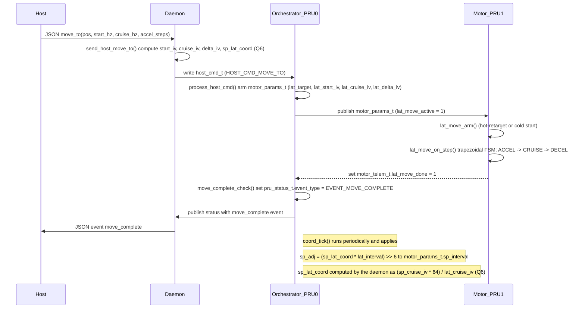

# Synchronization Sequence — Host → Daemon → PRU Orchestrator → PRU Motor

This document contains a Mermaid sequence diagram that illustrates the `move_to` flow and the spindle↔lateral coordination path. The diagram is in English and references the key functions in the codebase.

## Annotated function references

- `send_host_move_to()` — [src/linux/daemon/pickup_daemon.c](src/linux/daemon/pickup_daemon.c#L191)
- `process_host_cmd()` — [src/pru/orchestrator/main.c](src/pru/orchestrator/main.c#L174)
- `coord_tick()` — [src/pru/orchestrator/main.c](src/pru/orchestrator/main.c#L329)
- `move_complete_check()` — [src/pru/orchestrator/main.c](src/pru/orchestrator/main.c#L341)
- `lat_move_arm()` — [src/pru/motor_control/main.c](src/pru/motor_control/main.c#L77)
- `lat_move_on_step()` — [src/pru/motor_control/main.c](src/pru/motor_control/main.c#L127)

## Notes

- The diagram assumes the orchestrator runs on **PRU0** and the motor firmware runs on **PRU1** (see function headers for confirmation).
- The Q6 ratio avoids runtime division on the PRU; the daemon performs the integer division once when arming the move.
- Safety: endstops and software limits are checked by the orchestrator and will abort moves on fault.

